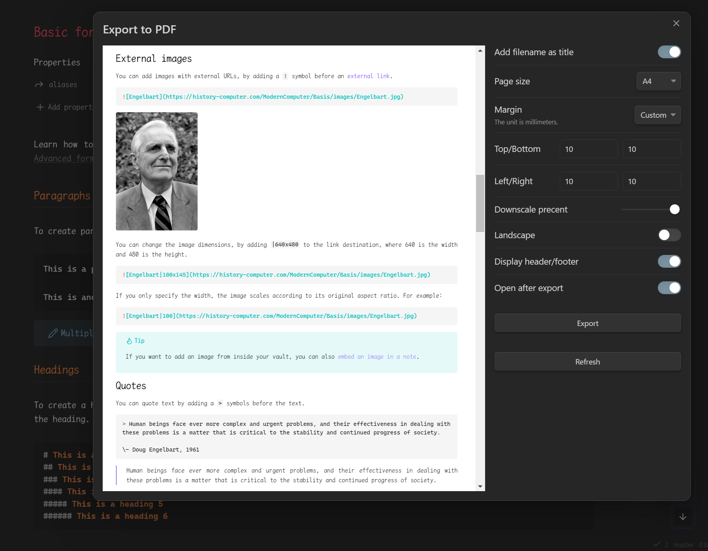
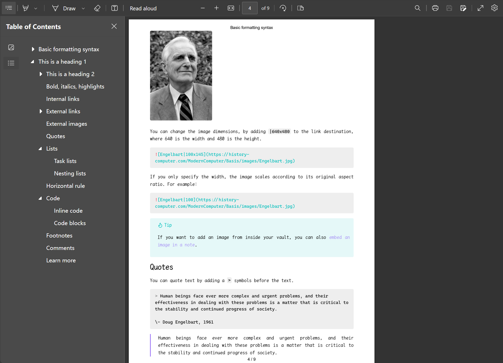

# AZcolle Export PDF

AZcolle Export PDF is an enhanced PDF export plugin for Obsidian, forked from [Better Export PDF](https://github.com/l1xnan/obsidian-better-export-pdf). It is specifically adapted for the AZcolle plugin ecosystem to export oral exam notes (colles) with enhanced PDF features.

## Features

Compared to the official Export PDF feature:

- 🚀Support export preview
- 🎉Export the outline bookmarks
- 🛩️Customize the margins
- ✨Export the page numbers
- 💥Support add PDF metadata from front matter
- 🎇Export internal links within file
- 🎈Export multiple Markdown files(folder or specified files) into one PDF file
- 🌸Batch export multiple PDF files
- 🍬Support exporting PDFs in any size, and can export all content onto a single page
- ... ...

## Installation

### Manual installation

1. Download the .zip file from the latest Release
2. Unzip into: `{VaultFolder}/.obsidian/plugins/azcolle-export/`
3. Reload Obsidian and enable the plug-in.

## Usage

1. Select export target:
   1. In the upper right corner of the current Markdown view, click More options and select `AZcolle Export PDF`;
   2. Open the command panel and select `AZcolle Export PDF: Export Current File to PDF`.
2. In the dialog box that is displayed, modify the configuration.
3. Click `Export`, select the export path, and if you don't need to modify the configuration, you can directly press the `Enter` key to trigger the export operation.

### Set the header and footer

Set page numbers using the `Header Template` and `Footer Template`, for example:

```html
<div style="width: 100vw;font-size:10px;text-align:center;">
  <span class="pageNumber"></span> / <span class="totalPages"></span>
</div>
```

See details [`<webview>.printToPDF(options)`](https://www.electronjs.org/docs/latest/api/webview-tag#webviewprinttopdfoptions).

It can be any HTML fragment, such as adding a base64 image:

```html
<div style="width: 100vw;font-size:10px;text-align:center;">
  
  <span class="title"></span>
</div>
```

Document level header/footer templates can also be configured in frontMatter:

- `headerTemplate`
- `footerTemplate`

### Customize the export style

If you want to further customize the PDF export style, you can add custom CSS in the `Appearance > CSS Snippet`, such as custom fonts and sizes:

```css
@media print {
  body {
    --font-interface-override: "Times New Roman" !important;
    --font-text-override: "Times New Roman" !important;
    --font-print-override: "Times New Roman" !important;
    --font-monospace-override: "Consolas" !important;
    --font-text-size: 20px !important;
    font-family: "Times New Roman" !important;
  }
}
```

### Select Disabled CSS Snippts

First, enable the `Select CSS snippets` option in the plugin configuration. This will allow you to see the `CSS snippets` option in the modal for exporting PDFs. From there, you can choose CSS snippets that have not been globally enabled in the `Appearance > CSS Fragments` section.

### Add PDF metadata

PDF Metadata can be added to through frontMatter of the configuration document. Supported field items are:

- `title`
- `author`
- `keywords`
- `created_at`
- `updated_at`
- `creator`
- `producer`

### Export multiple Markdown files

#### Quick export

Select the folder in the sidebar, right-click the menu `Export folder to PDF`, you can export the entire folder contents to a PDF file.

Note: This does not guarantee the file export order.

#### Custom export

Create a new table of contents note, add something like the following, need to add a `toc: true` document property:

```markdown
---
toc: true
---

## Table of Contents

[[Note1|Title1]]
[[Note2]]
[[Note2]]
```

This allows the plugin to export the notes in the order of the internal links. The anchor point of the exported PDF table of contents supports clicking to jump.

**Note**: When exporting with a Table of Contents file, right click on that toc-file and select `AZcolle Export PDF`. Do not use `Export Folder to PDF`.

### Folder batch export

Select the folder in the sidebar, right-click the menu `Export each file to PDF`, you can batch export each file of the entire folder to PDF file.

### Export as One Page

In the export dialog, select `Custom` for **Page Size** and set **Margin** to `None`. Set the page size according to the document's requirements.

---

**Note:** You can adjust the concurrency number during the rendering phase when exporting multiple files via `Plugin Settings > Limit Concurrency`. This can help reduce resource consumption or increase the speed. The default value is 5.

## Preview

### Export preview



### Effect picture



## Credits and License

### Original Project

This plugin is a fork of **[Better Export PDF](https://github.com/l1xnan/obsidian-better-export-pdf)** created by **[l1xnan](https://github.com/l1xnan)**.

We are extremely grateful to l1xnan for creating such a powerful and well-designed PDF export plugin for Obsidian. The original Better Export PDF plugin provided the solid foundation that made this fork possible.

**Support the original author:**
- [Buy l1xnan a coffee](https://www.buymeacoffee.com/l1xnan)
- [PayPal](https://paypal.me/l1xnan)
- GitHub: [https://github.com/l1xnan](https://github.com/l1xnan)

### AZcolle Export PDF

This fork is maintained by **AZcolle Team** and is specifically adapted for oral exams management (colles) in Moroccan preparatory classes (CPGE).

**Key differences from the original:**
- Renamed to integrate with the AZcolle plugin ecosystem
- Documentation adapted for the AZcolle use case
- Potential future customizations for colle-specific workflows

### License

This project is licensed under the MIT License, maintaining the same license as the original Better Export PDF project.

- Original Copyright (c) 2023 l1xnan
- Fork Copyright (c) 2025 AZcolle Team

See [LICENSE](./LICENSE) for full details.

---

**AZcolle Team** - Adapted for oral exams management in Moroccan preparatory classes (CPGE)